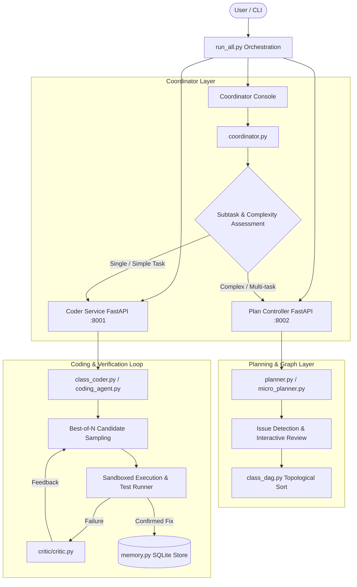

# agentSwarm
A local self-healing agent swarm that plans, generates and fixes the code itself.

# `agentSwarm` — System Architecture & Documentation

`agentSwarm` is a local, self-healing, multi-agent AI system designed for automated code generation, refactoring, and class-level software construction. It decomposes complex coding tasks into structured execution graphs (DAGs), generates and runs test suites inside sandboxed subprocesses, and corrects code failures through **Best-of-N candidate sampling**, **heuristic plan validation**, and **persistent fix memory**.

---

## 1. High-Level Architecture Overview



---

## 2. Core Subsystems & Components

### 2.1 Coordination & Task Routing
- **[run_all.py](file:///d:/autocode/agentSwarm/run_all.py)**: The primary entry point. Launches the **Coder Service** (`:8001`) and **Plan Controller** (`:8002`) as FastAPI background subprocesses via `uvicorn`, waits for health checks, and either starts the interactive console or runs a one-shot class build.
- **[coordinator.py](file:///d:/autocode/agentSwarm/coordinator.py)**: Evaluates input goals using structured LLM assessments (`subtask_estimate`, `is_simple`). Applies deterministic Python rules to route simple single-function tasks directly to the Coder, and multi-component tasks to the Planner.
- **[coordinator_console.py](file:///d:/autocode/agentSwarm/coordinator_console.py)**: Interactive REPL terminal interface allowing users to submit task prompts, monitor service logs, and inspect intermediate DAGs.
- **[class_coordinator.py](file:///d:/autocode/agentSwarm/class_coordinator.py)**: Manages class-level software construction. Takes a `plan.json` and a skeleton file, orders node builds via `class_dag.py`, and sequentially invokes `solve_init_member` and `solve_member` on the Coder Service.

### 2.2 Planning & Class Graph Management
- **[planner.py](file:///d:/autocode/agentSwarm/planner.py)**: Converts high-level functional goals into a Directed Acyclic Graph of subtasks (`TaskDAG`). Validates against missing dependencies and cyclic graphs.
- **[micro_planner.py](file:///d:/autocode/agentSwarm/micro_planner.py)**: Generates granular class-level micro-plans (`plan.json`) containing constructor attributes (`members`) and methods (`methods`), complete with type signatures and dependencies.
- **[plan_controller.py](file:///d:/autocode/agentSwarm/plan_controller.py)**: FastAPI wrapper around `planner.py`. Incorporates plan issue detection (detecting dropped entity names, missing dependencies, scope drift, and language mismatches) and interactive human review.
- **[class_dag.py](file:///d:/autocode/agentSwarm/class_dag.py)**: Kahn's algorithm-based topological sorter for unifying constructor members and methods into a strict step-by-step build sequence.
- **[microplan_to_member.py](file:///d:/autocode/agentSwarm/microplan_to_member.py)**: Transpiles a micro-plan `plan.json` into a Python class skeleton file populated with `__init__` stubs and method stubs.
- **[micro_plan_fixer.py](file:///d:/autocode/agentSwarm/micro_plan_fixer.py)**: Static analysis tool to audit and repair broken `plan.json` files before skeleton generation.

### 2.3 Code Generation, Testing & Sandboxing
- **[coder_service.py](file:///d:/autocode/agentSwarm/coder_service.py)**: FastAPI microservice exposing HTTP endpoints (`/solve`, `/solve_member`, `/solve_init_member`) for code execution and method-level generation.
- **[coding_agent.py](file:///d:/autocode/agentSwarm/coding_agent.py)**: Core self-correcting agent loop:
  - **Best-of-N Candidate Sampling**: Generates $N$ parallel code/fix candidates per iteration round to maximize hit-rate and prevent local minima traps.
  - **Lightweight Subprocess Sandbox**: Runs generated code and unit tests inside isolated processes with strict CPU (`RLIMIT_CPU`) and memory (`RLIMIT_AS`) resource limits (on POSIX systems).
  - **Test Verification & Auto-Escalation**: Pauses execution to allow human test review if persistent failures occur across multiple rounds.
- **[class_coder.py](file:///d:/autocode/agentSwarm/class_coder.py)**: Handles individual method and constructor member implementations within an evolving class file.

### 2.4 Code Review & Memory
- **[critic/critic.py](file:///d:/autocode/agentSwarm/critic/critic.py)**: Standalone code reviewer that accepts source code, command strings, task specs, and execution error logs, returning structured JSON critiques (`pass`, `needs_fixes`, `fail`) with severity ratings (`critical`, `major`, `minor`, `nit`).
- **[memory.py](file:///d:/autocode/agentSwarm/memory.py)**: Persistent SQLite database (`memory.db`) storing **confirmed working fixes**. Uses Jaccard keyword stem matching for deduplication on write and past-fix retrieval before coding rounds.

### 2.5 Runtime DAG Execution
- **[dag_integrator.py](dag_integrator.py)**: A standalone runtime execution engine for wiring built agent classes together via a dependency graph and running them in topological order. Whereas `class_dag.py` and `class_coordinator.py` govern *build-time* ordering of code generation, `DAGIntegrator` operates at *runtime* — it takes already-implemented agent classes and a user-supplied dependency map and actually executes them end-to-end.

  **Key behaviours:**
  - **Lazy instantiation**: Accepts either class types (preferred) or pre-built instances. Passing class types ensures constructors with side effects (e.g. opening DB connections) don't run until all dependencies have finished.
  - **Kahn's BFS execution**: Resolves execution order at runtime via an in-degree queue, collecting each node's `.run()` return value and forwarding it as positional arguments to dependent nodes.
  - **Early validation**: `_validate()` catches missing node registrations and unknown dependency references before execution starts, preventing silent runtime failures.
  - **Cycle detection**: After BFS completes, confirms all nodes were visited; any remainder raises `ValueError` indicating a cycle or unreachable node.

  **Usage:**
  ```python
  from dag_integrator import DAGIntegrator

  integrator = DAGIntegrator(
      classes={
          "ConfigLoader": ConfigLoader,
          "DatabaseConnector": DatabaseConnector,
          "Reporter": Reporter,
      },
      dag={
          "ConfigLoader": [],
          "DatabaseConnector": ["ConfigLoader"],
          "Reporter": ["DatabaseConnector"],
      }
  )

  outputs, order = integrator.execute()
  # outputs["Reporter"] holds the final result


### Relationship to the rest of the system: DAGIntegrator is the natural runtime counterpart to the planning and class-building pipeline. Once class_coordinator.py has generated and assembled all class files, DAGIntegrator can wire their instances together and drive a full end-to-end execution run without any further orchestration code.
---

## 3. Microservice API Specifications

### Coder Service (`http://localhost:8001`)

| Endpoint | Method | Description |
| :--- | :--- | :--- |
| `/health` | `GET` | Health check liveness probe. |
| `/solve` | `POST` | Executes complete task solving loop for a standalone prompt. |
| `/solve_member` | `POST` | Implements or updates a single class method in context. |
| `/solve_init_member` | `POST` | Implements or updates constructor initialization for a specific attribute. |
| `/tasks/{task_id}` | `GET` | Inspects stored job status and results by task ID. |

### Plan Controller Service (`http://localhost:8002`)

| Endpoint | Method | Description |
| :--- | :--- | :--- |
| `/health` | `GET` | Health check liveness probe. |
| `/plan` | `POST` | Generates subtask DAG from goal, runs heuristic issue detection, and executes review. |
| `/jobs/{task_id}` | `GET` | Retrieves generated plan graph and flagged issues for a task ID. |

---

## 4. Key Workflows & Execution Paths

### Workflow 1: Standard Interactive Mode
```
User Prompt -> coordinator.py (assess complexity)
               ├── Simple -> POST /solve to Coder Service -> coding_agent.py
               └── Complex -> POST /plan to Plan Controller -> planner.py -> TaskDAG -> Coder Service
```

### Workflow 2: One-Shot Class Building Mode
```
plan.json + skeleton.py 
   │
   ▼
class_coordinator.build_class()
   │
   ├── 1. Construct ClassDAG (members & methods)
   ├── 2. Kahn's Topological Sort
   ├── 3. For each member in DAG -> POST /solve_init_member
   ├── 4. For each method in DAG -> POST /solve_member
   └── 5. Assemble and output final Python class
```

---

## 5. Getting Started & Local Setup

### Prerequisites
- Python 3.10+
- `ollama` (if using local LLM inference) or API keys for OpenAI / Anthropic

### Running Interactive Console
To launch the full swarm with Ollama local inference:
```bash
python3 run_all.py --backend ollama --ollama-model deepseek-coder-v2:16b
```

To run with mock backend (for testing pipeline mechanics without LLM setup):
```bash
python3 run_all.py --backend mock
```

### Running One-Shot Class Build
```bash
python3 run_all.py \
  --plan-file output_examples/plan.json \
  --skeleton-file output_examples/RateLimiter_skeleton.py \
  --backend mock \
  --out final_RateLimiter.py
```

---

## 6. Key Design Principles & Engineering Highlights

1. **Decoupled Standalone Design**: Each core module (`planner.py`, `coding_agent.py`, `critic.py`, `memory.py`, `coordinator.py`) maintains its own minimal LLM invocation helpers. Modules can be tested and run independently via CLI without importing each other.
2. **Best-of-N Parallel Sampling**: Instead of single-path retry loops, `coding_agent.py` uses `ThreadPoolExecutor` to sample multiple candidates concurrently, selecting the candidate with the highest test pass score.
3. **Deterministic Routing Safeguards**: LLMs assist in assessing subtask counts and task simplicity, but routing decisions are strictly enforced in Python logic.
4. **Sandboxed Subprocess Execution**: Unit tests and generated code are evaluated in isolated subprocesses using Linux resource limits (`rlimit`) to protect against infinite loops and memory leaks.
5. **Verified Memory Deduping**: `memory.py` only stores confirmed, post-verification fixes and automatically increments frequency counters for matching error patterns using Jaccard keyword stem similarity.
